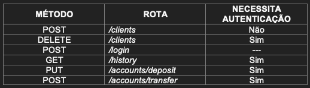
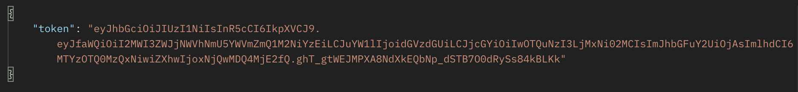
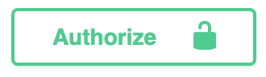
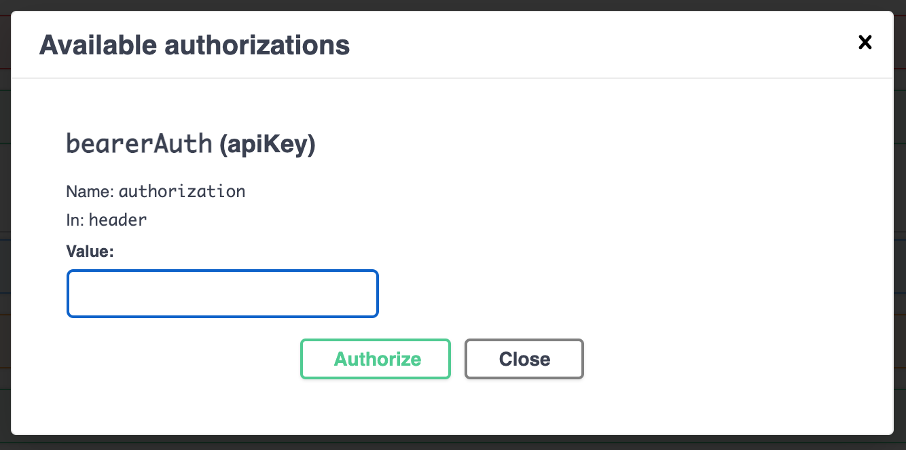
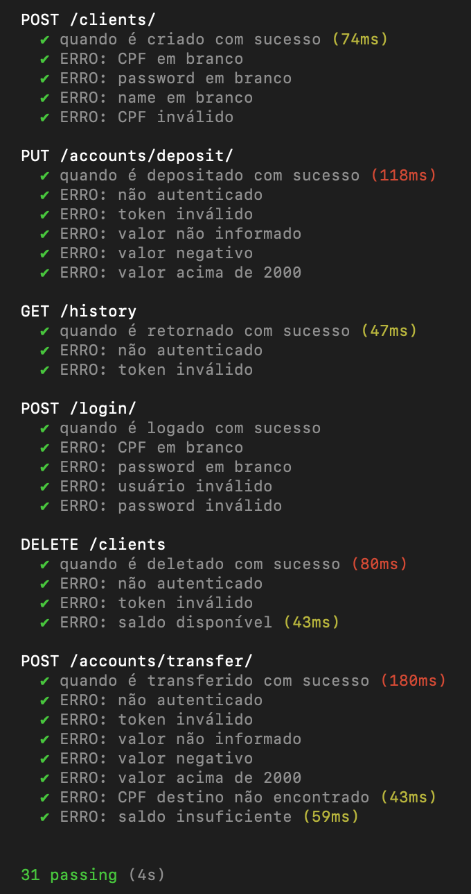

### Atenção
⚠️ **Importante** ⚠️:

Para CPF, esta API aceita como entradas válidas strings seguindo o pattern 'XXX.XXX.XXX-XX'.

# Repositório do projeto BankAPI 💵 !

API simples para gerenciamento de transações bancárias desenvolvida em Node.js.

---

# Sumário

- [Início](#repositório-do-projeto-bankapi)
- [Geral](#geral)
- [Documentação](#documentação)
- [Resumo de endpoints](#resumo-de-endpoints)
- [Autenticação](#autenticação)
- [Regras](#regras)
- [Testes](#testes)
- [Contato](#contato)

---

# Geral

API acessível através do link: 

[simple-bank-api.herokuapp.com](https://simple-bank-api.herokuapp.com/)

---

# Documentação

A documentação completa da API está disponível através do seguinte link:

[Documentação](https://simple-bank-api.herokuapp.com/api-docs/) 

É possível, também, testar requisições na página de documentação.

---

## Resumo de endpoints

A descrição completa dos endpoints pode ser consultada na [documentação](#documentação), através do seguinte link: 

[Documentação](https://simple-bank-api.herokuapp.com/api-docs/) 

---

## Autenticação

Para autenticar-se, é necessário informar o token retornado ao se executar um login válido.

Ao se fazer uma requisição à API, tal token deve ser informado no campo Authorization, no cabeçalho da requisição.

Autenticando-se na documentação, caso esteja usando a [documentação](#documentação), para autenticar-se bata clicar no botão "Authorize",

e inserir o token na janela que se abrirá (sem aspas).

---

## Regras

- Para abrir uma conta é necessário apenas o nome completo e CPF da pessoa, mas só é permitido uma conta por pessoa;
- Com essa conta é possível realizar transferências para outras contas e depositar;
- Não aceitamos valores negativos nas contas;
- Por questão de segurança cada transação de depósito não pode ser maior do que R$2.000;
- As transferências entre contas são gratuitas e ilimitadas;

---

## Testes

Foram executados testes de integração cobrindo os seguintes casos:

Os aquivos de teste encontram-se no diretório './tests'.

---

# Contato

Dev: [Eric Faria](mailto:ericdeofaria@gmail.com)

---
